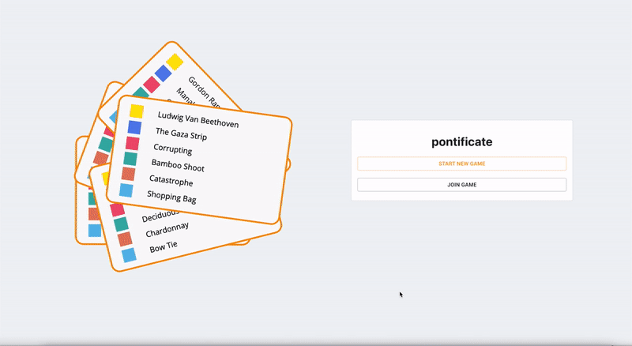

# [Pontificate](https://pontificate.click)

Wanting to play the board game ‘Articulate’ anywhere without the board, I took inspiration from ‘JackBox’ and built an online game. The code was written with a Node.js backend with Socket.io for the connections, with React on the frontend. The game is played with the board cast onto a TV, and players joining in on their phones.

---

<p align="center">
  
</p>

### Tech

React/TypeScript on the front end with Material.ui
Node/Socket.io with TypeScript on the backend

This is hosted in AWS with the following;

- **EC2** running an ubunutu instance hosting the Node server 

- **S3 bucket** servering the client behind a **CloudFront** distrubution

## Local Hosting 

You will need to have the [pontificate-backend](https://github.com/allister-grange/pontificate-backend) running locally. 

Please also have a ```.env``` file located in your root directory with the following configuration:
```
PORT=3005
ENV=local
```

Start the site with ```npm start```
